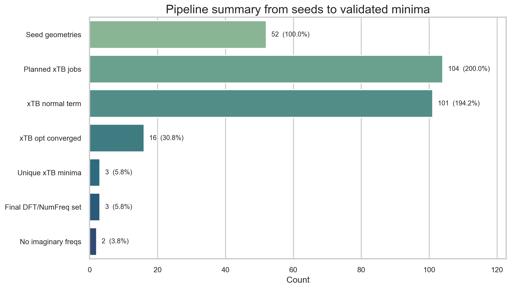
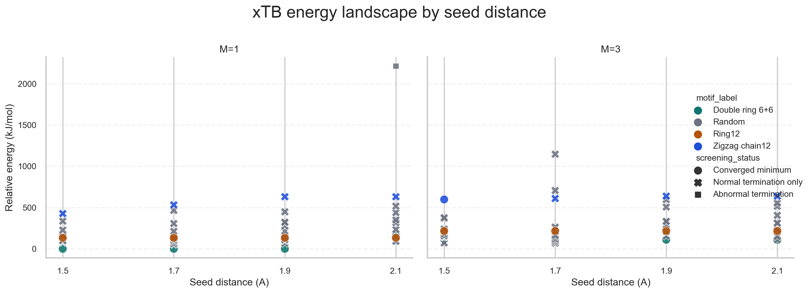
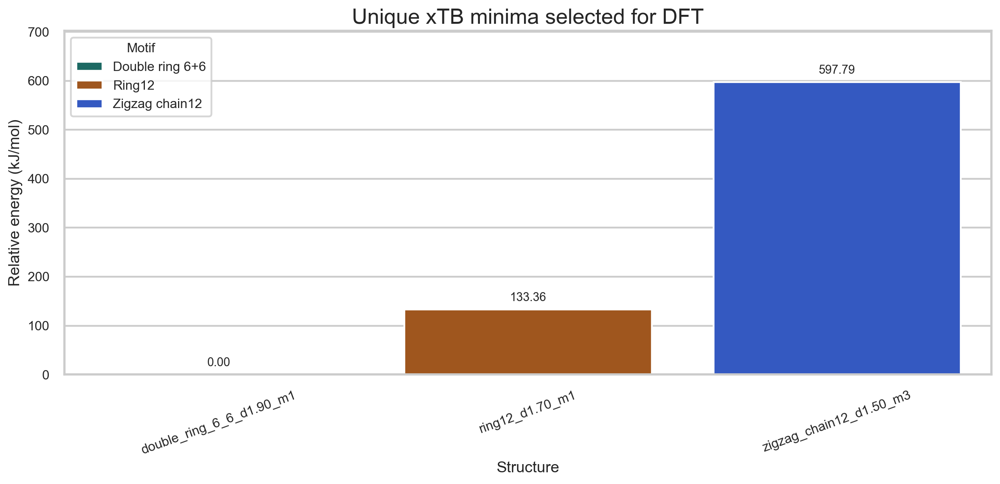
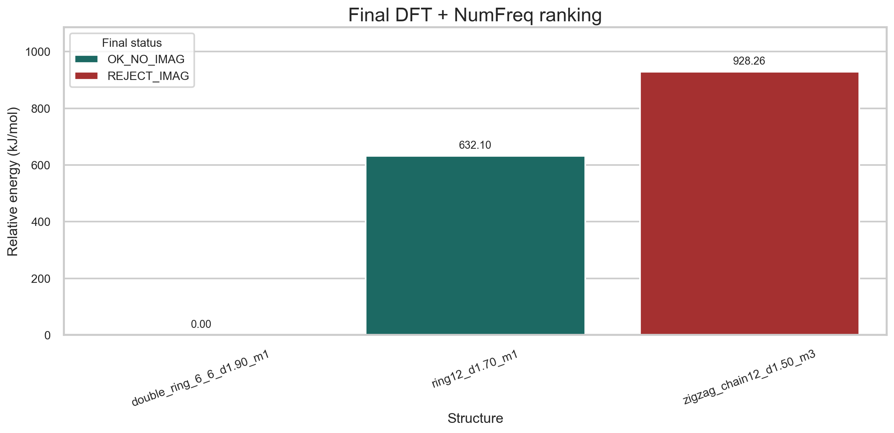
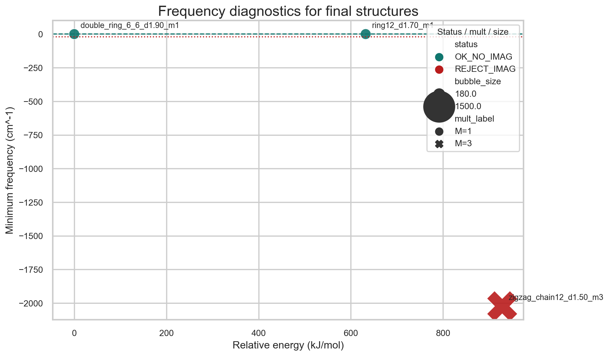

# Академический отчет по расчетам кластера B12

## Название работы

Многостадийный поиск низкоэнергетических структур нейтрального кластера B12 методом многостартового скрининга `GFN2-xTB` с последующим уточнением на уровне `r2SCAN-3c` и проверкой колебательной устойчивости расчетом `NumFreq` в ORCA 6.1.

## Аннотация

В настоящей работе выполнен вычислительный поиск устойчивых структур нейтрального кластера B12. Поскольку для малых борных кластеров поверхность потенциальной энергии содержит значительное число локальных минимумов, а результат локальной оптимизации сильно зависит от начальной геометрии, использован многостартовый протокол. На первом этапе были сформированы регулярные и случайные стартовые структуры при нескольких характерных межатомных расстояниях. Для каждой геометрии и для двух мультиплетностей проведена предварительная оптимизация методом `GFN2-xTB`. Полученные структуры были отфильтрованы по признакам нормального завершения, реальной сходимости геометрической оптимизации и структурной уникальности.

Низкоэнергетические уникальные кандидаты затем были переоптимизированы методом `r2SCAN-3c` с настройками `TightOpt TightSCF`, после чего для них выполнен расчет численных колебательных частот `NumFreq`. По результатам расчетов установлено, что наиболее низкой энергией в исследованной выборке обладает синглетная структура `double_ring_6_6_d1.90_m1_r2scan` с энергией `-297.805239027148 Eh`. Вторая синглетная структура `ring12_d1.70_m1_r2scan` также соответствует истинному минимуму, однако расположена выше по энергии на `632.10 кДж/моль`. Триплетная структура `zigzag_chain12_d1.50_m3_r2scan` имеет `6` мнимых частот, из которых `5` являются значимыми, и потому не может рассматриваться как устойчивый минимум. В рамках использованного расчетного протокола наиболее стабильной формой B12 является двухкольцевой синглетный мотив.

## Ключевые слова

B12, борный кластер, ORCA 6.1, GFN2-xTB, r2SCAN-3c, NumFreq, многостартовый поиск, локальные минимумы, мнимые частоты, вычислительная химия.

## 1. Введение

Поиск устойчивых структур малых борных кластеров относится к числу сложных задач вычислительной химии. Даже при фиксированном составе система может иметь несколько геометрических мотивов, различающихся топологией, упаковкой атомов и спиновым состоянием. В таких условиях одна локальная оптимизация, выполненная из произвольной начальной конфигурации, не гарантирует нахождения глобального минимума. Корректный подход требует серии независимых стартов с последующим автоматизированным отбором низкоэнергетических и структурно неэквивалентных решений.

Для кластера B12 такая постановка особенно важна. Если ограничиться одной стартовой геометрией, можно получить локальный минимум и ошибочно принять его за наиболее устойчивую форму. Поэтому в настоящем проекте реализован каскадный протокол: сначала выполняется широкий и сравнительно дешевый скрининг большого числа начальных конфигураций методом `GFN2-xTB`, затем отбираются уникальные низкоэнергетические кандидаты, которые уточняются методом `r2SCAN-3c`, а окончательное решение принимается только после частотной проверки `NumFreq`.

Все численные значения в настоящем отчете взяты из фактических файлов проекта: `settings.json`, результатов `xTB`, итоговых DFT-таблиц и частотных отчетов. Отчет описывает не гипотетическую схему, а реально выполненный расчетный прогон.

## 2. Цель и задачи исследования

Целью работы являлось определение наиболее устойчивой структуры нейтрального кластера B12 в исследованном наборе геометрических мотивов и мультиплетностей, а также подтверждение того, что финальные структуры соответствуют истинным минимумам на поверхности потенциальной энергии.

Для достижения этой цели были поставлены следующие задачи:

1. сформировать представительный набор начальных геометрий B12, включающий регулярные и случайные конфигурации;
2. выполнить предварительный энергетический и геометрический скрининг методом `GFN2-xTB`;
3. удалить структурные дубликаты и выделить уникальные низкоэнергетические кандидаты;
4. провести DFT-переоптимизацию лучших структур методом `r2SCAN-3c`;
5. проверить колебательную устойчивость финальных структур расчетом `NumFreq`;
6. составить итоговый ранжированный список структур и выделить формы без мнимых частот.

## 3. Исходные данные и вычислительные параметры

Расчеты выполнены в пакете ORCA 6.1. Основные параметры конвейера заданы в файле `settings.json`. Для исследуемой системы использованы следующие настройки.

| Параметр | Значение |
| --- | --- |
| Система | `B12` |
| Заряд кластера | `0` |
| Число атомов | `12` |
| Рассмотренные мультиплетности | `1`, `3` |
| Стартовые расстояния, Å | `1.5`, `1.7`, `1.9`, `2.1` |
| Число случайных стартов на каждое расстояние | `10` |
| Seed генератора случайных чисел | `42` |
| Минимально допустимое расстояние при генерации, Å | `1.15` |
| Порог распознавания дубликатов, Å | `0.05` |
| Порог значимой мнимой частоты, см⁻¹ | `-20.0` |
| Метод предварительного скрининга | `GFN2-xTB` |
| Настройка xTB | `TightSCF TightOpt` |
| Число процессов на xTB-этапе | `1` |
| Память на xTB-этапе | `500 MB` |
| DFT-метод уточнения | `r2SCAN-3c` |
| Настройка DFT | `TightSCF TightOpt` |
| Число процессов на DFT-этапе | `8` |
| Память на DFT-этапе | `2000 MB` |
| Частотный этап | `r2SCAN-3c TightSCF NumFreq` |
| Формальный лимит числа структур для DFT | `10` |
| Формальный лимит числа структур для NumFreq | `5` |

Расчеты выполнялись на VPS-конфигурации `8 CPU / 24 GB RAM`.

## 4. Вычислительный протокол

### 4.1. Формирование стартовых геометрий

Генерация исходных структур выполнялась командой `pipeline.py make-starts`. В набор включались три регулярных мотива:

- `ring12`
- `double_ring_6_6`
- `zigzag_chain12`

Кроме регулярных структур, автоматически формировались случайные компактные конфигурации с ограничением на минимальное межатомное расстояние. Для каждого из четырех стартовых расстояний были созданы все три регулярные структуры и десять случайных конфигураций. В результате было получено:

- `12` регулярных стартов;
- `40` случайных стартов;
- всего `52` стартовые геометрии.

Такой набор позволяет одновременно исследовать как химически осмысленные начальные мотивы, так и менее предсказуемые случайные конфигурации, которые потенциально могут привести к новым минимумам.

### 4.2. Постановка xTB-скрининга

Для каждой стартовой геометрии автоматически создавались входные файлы ORCA со строкой ключевых слов:

`! GFN2-xTB TightSCF TightOpt`

Поскольку в расчет были включены две мультиплетности (`1` и `3`), для каждой из `52` геометрий формировались два расчета. Таким образом, основной набор xTB-задач содержал:

`52 x 2 = 104` постановки.

На этом этапе использовались `1` процесс и `500 MB` памяти на задачу, что делало процедуру пригодной для массового автоматизированного скрининга.

### 4.3. Критерии отбора xTB-результатов

После завершения xTB-этапа скрипт `pipeline.py rank-xtb` извлекал:

- финальную энергию;
- финальные декартовы координаты;
- признак нормального завершения расчета;
- признак сходимости геометрической оптимизации.

Для дальнейшего структурного анализа сохранялись только те расчеты, у которых одновременно выполнялись условия:

1. расчет завершился нормально;
2. энергия была успешно распознана;
3. оптимизация была отмечена как сошедшаяся;
4. финальные координаты были корректно извлечены.

Этот шаг исключает случаи, когда программа завершилась без аварии, но геометрия не достигла полноценного минимума.

### 4.4. Удаление структурных дубликатов

Структурные дубликаты распознавались по fingerprint-представлению, основанному на всех попарных межъядерных расстояниях, отсортированных по величине. Для сравнения использовалось RMS-отклонение между такими векторами расстояний. Если оно было меньше порога `0.05 Å`, структуры считались эквивалентными, и в итоговый список включался только более низкоэнергетический представитель.

Этот подход удобен тем, что практически не зависит от ориентации структуры в пространстве и позволяет автоматически отсеивать повторяющиеся минимумы, полученные из разных стартовых конфигураций.

### 4.5. DFT-переоптимизация

Для отобранных кандидатов автоматически формировались входные файлы:

`! r2SCAN-3c TightSCF TightOpt`

DFT-этап выполнялся с параметрами `nprocs = 8` и `MaxCore = 2000 MB`. Хотя настройки допускали отправку на этот этап до `10` лучших xTB-структур, фактически после фильтрации и удаления дублей пригодными оказались только `3` уникальные структуры, именно они и были переданы на DFT-уточнение.

### 4.6. Частотный анализ NumFreq

Для финальных DFT-структур создавались входные файлы:

`! r2SCAN-3c TightSCF NumFreq`

Из частотных выходов извлекались:

- финальная энергия;
- число распознанных частот;
- минимальная частота;
- число отрицательных частот по строгому критерию `n_imag_strict`;
- число значимых отрицательных частот `n_imag_significant`, то есть частот ниже `-20.0 см⁻¹`.

В настоящем наборе данных реализовались два итоговых статуса:

| Статус | Интерпретация |
| --- | --- |
| `OK_NO_IMAG` | отрицательных частот нет |
| `REJECT_IMAG` | присутствуют значимые мнимые частоты |

### 4.7. Формула расчета относительных энергий

Для сравнения структур использовались относительные энергии, вычисленные по формуле:

`ΔE_i = (E_i - E_min) x 2625.49962`,

где `E_i` и `E_min` выражены в Hartree, а коэффициент `2625.49962` переводит результат в `кДж/моль`.

## 5. Результаты и обсуждение

### 5.1. Статистика расчетного конвейера

В файле `results/xtb_ranked_all.csv` присутствуют две технические тестовые записи `test_xtb_fix` и `test_xtb_fix2`, поэтому статистика xTB-этапа ниже рассчитывается по основному рабочему набору из `104` постановок.

**Таблица 1.** Сводка выполненного расчетного протокола.

| Этап | Число объектов | Комментарий |
| --- | ---: | --- |
| Сгенерированные стартовые геометрии | 52 | `12` регулярных + `40` случайных |
| Запланированные xTB-расчеты | 104 | две мультиплетности для каждой геометрии |
| xTB-расчеты с нормальным завершением | 101 | `97.12%` от основного набора |
| xTB-расчеты со сходимостью оптимизации | 16 | `15.38%` от основного набора |
| Уникальные xTB-минимумы после удаления дублей | 3 | итоговый набор для DFT |
| DFT-расчеты | 3 | все завершились успешно |
| NumFreq-структуры | 3 | для всех DFT-кандидатов |
| Структуры без мнимых частот | 2 | `66.67%` от NumFreq-набора |

Статистика показывает, что многостартовый поиск действительно необходим. Из `104` xTB-постановок лишь `16` дали одновременно сошедшиеся и пригодные для дальнейшего анализа структуры, а после удаления дублей к DFT-этапу перешли только `3` кандидата.

### 5.2. Сошедшиеся xTB-структуры по семействам

Среди `16` сошедшихся xTB-оптимизаций воспроизводились следующие структурные семейства.

**Таблица 2.** Сошедшиеся xTB-структуры по семействам и мультиплетностям.

| Семейство | Мультиплетность | Число сошедшихся запусков | Представитель | Энергия xTB, Eh | ΔE, кДж/моль |
| --- | ---: | ---: | --- | ---: | ---: |
| `double_ring_6_6` | 1 | 3 | `double_ring_6_6_d1.90_m1` | -14.30221528287 | 0.00 |
| `double_ring_6_6` | 3 | 4 | `double_ring_6_6_d1.50_m3` | -14.26034557896 | 109.93 |
| `ring12` | 1 | 4 | `ring12_d1.70_m1` | -14.25142097305 | 133.36 |
| `ring12` | 3 | 4 | `ring12_d1.70_m3` | -14.21985653280 | 216.23 |
| `zigzag_chain12` | 3 | 1 | `zigzag_chain12_d1.50_m3` | -14.07452728838 | 597.79 |

Из таблицы видно, что одни и те же структурные мотивы воспроизводятся из нескольких стартовых расстояний и начальных конфигураций. Это свидетельствует о том, что найденные решения не являются случайным результатом единичного запуска. Кроме того, для семейств `double_ring_6_6` и `ring12` синглетные варианты оказываются энергетически выгоднее соответствующих триплетных состояний.

### 5.3. Уникальные структуры после xTB-скрининга

После удаления геометрических дублей и сохранения только наиболее низкоэнергетического представителя в каждом семействе были получены `3` уникальные структуры.

**Таблица 3.** Уникальные минимумы после xTB-скрининга.

| Ранг xTB | Структура | Мультиплетность | Энергия xTB, Eh | ΔE, кДж/моль |
| --- | --- | ---: | ---: | ---: |
| 1 | `double_ring_6_6_d1.90_m1` | 1 | -14.30221528287 | 0.00 |
| 2 | `ring12_d1.70_m1` | 1 | -14.25142097305 | 133.36 |
| 3 | `zigzag_chain12_d1.50_m3` | 3 | -14.07452728838 | 597.79 |

Таким образом, к DFT-этапу были переданы три структурно различных кандидата: двухкольцевой синглет, кольцевой синглет и зигзагообразный триплет.

### 5.4. Результаты DFT-уточнения и частотного анализа

После переоптимизации методом `r2SCAN-3c` и проверки расчетом `NumFreq` получены следующие итоговые данные.

**Таблица 4.** Финальные результаты `r2SCAN-3c` и `NumFreq`.

| Ранг DFT | Структура | Мультиплетность | Энергия DFT, Eh | Энергия NumFreq, Eh | ΔE, кДж/моль | Мин. частота, см⁻¹ | `n_imag_strict` | `n_imag_significant` | Статус |
| --- | --- | ---: | ---: | ---: | ---: | ---: | ---: | ---: | --- |
| 1 | `double_ring_6_6_d1.90_m1_r2scan` | 1 | -297.805239027148 | -297.805239047221 | 0.00 | 0.0 | 0 | 0 | `OK_NO_IMAG` |
| 2 | `ring12_d1.70_m1_r2scan` | 1 | -297.564484568076 | -297.564484546490 | 632.10 | 0.0 | 0 | 0 | `OK_NO_IMAG` |
| 3 | `zigzag_chain12_d1.50_m3_r2scan` | 3 | -297.451682484110 | -297.451682490386 | 928.26 | -2022.99 | 6 | 5 | `REJECT_IMAG` |

Порядок структур, найденный на этапе `GFN2-xTB`, полностью сохраняется после DFT-уточнения. Это означает, что предварительный полуэмпирический этап корректно выполнил роль фильтра и не исказил качественную картину ранжирования.

### 5.5. Обсуждение финальных структур

#### 5.5.1. Глобальный минимум

Наиболее низкую энергию имеет структура `double_ring_6_6_d1.90_m1_r2scan`. Она:

1. занимает первое место уже на xTB-этапе;
2. сохраняет лидерство после `r2SCAN-3c`;
3. не имеет мнимых частот по результатам `NumFreq`.

Следовательно, именно эта структура должна рассматриваться как наиболее вероятный глобальный минимум в пределах исследованного набора стартовых геометрий, мультиплетностей и использованного уровня теории.

#### 5.5.2. Локальный минимум кольцевого типа

Структура `ring12_d1.70_m1_r2scan` также проходит частотную проверку и потому соответствует истинному локальному минимуму на поверхности потенциальной энергии. Однако ее энергия выше энергии лидера на `632.10 кДж/моль`, что делает этот мотив существенно менее выгодным по сравнению с двухкольцевой формой.

Таким образом, кольцевой мотив не является вычислительным артефактом, но проигрывает глобальному минимуму по энергетике.

#### 5.5.3. Неустойчивость триплетного зигзагообразного мотива

Структура `zigzag_chain12_d1.50_m3_r2scan` не выдерживает частотную проверку. Для нее получено:

- `6` отрицательных частот по строгому критерию;
- `5` значимых отрицательных частот ниже `-20.0 см⁻¹`;
- минимальная частота `-2022.99 см⁻¹`.

Такой результат нельзя интерпретировать как малый численный шум. Он указывает на выраженную колебательную неустойчивость, а следовательно, данная структура не соответствует истинному минимуму и должна быть исключена из финального набора устойчивых форм.

#### 5.5.4. Согласованность DFT и NumFreq-энергий

Для всех финальных структур разность между `dft_energy_hartree` и `numfreq_energy_hartree` остается очень малой. Максимальное абсолютное расхождение составляет `2.16 x 10^-8 Eh`, что соответствует примерно `5.67 x 10^-5 кДж/моль`. Это подтверждает внутреннюю согласованность итоговых расчетов и показывает, что частотный анализ выполнялся на корректно определенных финальных геометриях.

### 5.6. Графическая иллюстрация результатов

Ниже приведены основные графические материалы, автоматически сформированные по результатам расчетного конвейера. Они дополняют табличные данные и позволяют визуально проследить ход отбора структур на разных этапах.

**Рисунок 1.** Сводка расчетного конвейера от стартовых геометрий до финального набора структур без мнимых частот.

Этот график наглядно показывает сильное сужение набора кандидатов: от `52` стартовых геометрий и `104` xTB-постановок к `3` DFT-кандидатам и `2` финальным устойчивым минимумам.

**Рисунок 2.** Энергетический ландшафт xTB-результатов.

На графике видно, что семейство `double_ring_6_6` формирует наиболее низкоэнергетическую область уже на стадии предварительного скрининга, тогда как `zigzag_chain12` располагается заметно выше по энергии.

**Рисунок 3.** Уникальные минимумы после xTB-скрининга и удаления структурных дублей.

Этот рисунок иллюстрирует итог xTB-отбора: после удаления дублей сохраняются только три структурно различных кандидата, переданные на DFT-уточнение.

**Рисунок 4.** Финальное сопоставление DFT-энергий и результатов частотного анализа.

На рисунке ясно видно, что только две синглетные структуры имеют статус `OK_NO_IMAG`, тогда как триплетный зигзагообразный мотив исключается из финального ряда.

**Рисунок 5.** Диагностика частотного анализа для финальных структур.

Частотная диаграмма подтверждает, что структура `zigzag_chain12_d1.50_m3_r2scan` содержит выраженные отрицательные частоты, тогда как для двух принятых минимумов мнимые частоты отсутствуют.

## 6. Ограничения исследования

Несмотря на внутреннюю согласованность расчетного протокола, итоговые выводы следует интерпретировать в рамках его области применимости.

1. Использован конечный набор стартовых геометрий, поэтому нельзя гарантировать полное покрытие всей поверхности потенциальной энергии B12.
2. На уровне спинового поиска были рассмотрены только мультиплетности `1` и `3`.
3. Метод `GFN2-xTB` применялся как фильтр для отбора кандидатов, а не как основание для окончательного энергетического вывода.
4. Финальное ранжирование относится к уровню теории `r2SCAN-3c`; при смене метода или расширении набора стартовых структур количественные результаты могут измениться.
5. Единственный триплетный кандидат оказался неустойчивым, однако это не доказывает невозможность любых триплетных форм B12 вне исследованного набора стартовых условий.

## 7. Заключение

По результатам выполненного исследования можно сформулировать следующие основные выводы.

1. Для кластера B12 реализован последовательный вычислительный протокол `GFN2-xTB -> r2SCAN-3c -> NumFreq`, основанный на многостартовом поиске.
2. Сформированы `52` стартовые геометрии, включающие регулярные и случайные конфигурации.
3. С учетом двух мультиплетностей выполнена постановка `104` рабочих xTB-расчетов.
4. Из них `101` завершились нормально, однако только `16` дали сошедшиеся геометрические оптимизации, пригодные для дальнейшего анализа.
5. После удаления дубликатов выделены `3` уникальные низкоэнергетические структуры.
6. Все три структуры успешно уточнены методом `r2SCAN-3c`.
7. Частотный анализ показал, что только `2` структуры являются истинными минимумами без мнимых частот.
8. Наиболее низкую энергию имеет синглетная структура `double_ring_6_6_d1.90_m1_r2scan` с энергией `-297.805239027148 Eh`.
9. Структура `ring12_d1.70_m1_r2scan` также является истинным минимумом, но лежит выше по энергии на `632.10 кДж/моль`.
10. Триплетная структура `zigzag_chain12_d1.50_m3_r2scan` является колебательно неустойчивой и исключается из финального набора.

Итоговый вывод состоит в том, что в пределах использованного набора стартов, рассмотренных мультиплетностей и уровня теории `r2SCAN-3c` наиболее стабильной структурой кластера B12 является двухкольцевой синглетный мотив `double_ring_6_6`.
